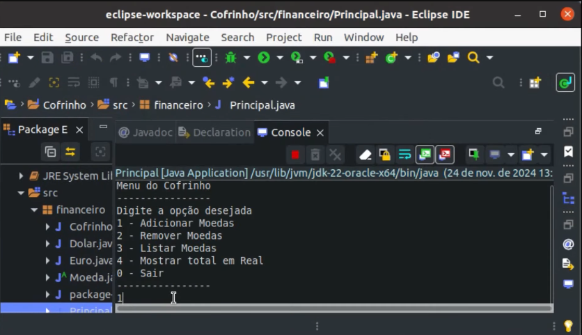
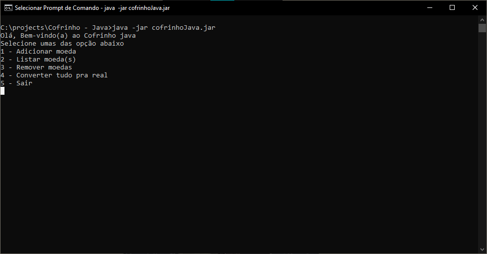

<h1 align="center">Cofrinho/Conversor de Moeda - Java</h1>
<h3 align="center">Projeto realizado para prática de POOr.</h3>
<h4>Executando o projeto:</h4>

Para executar, basta baixar o repositório, instalar o SDK Java e dar o comando pelo próprio terminal

